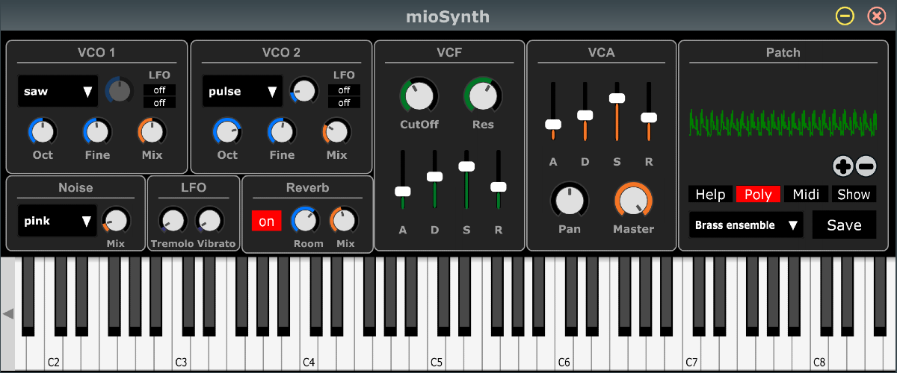
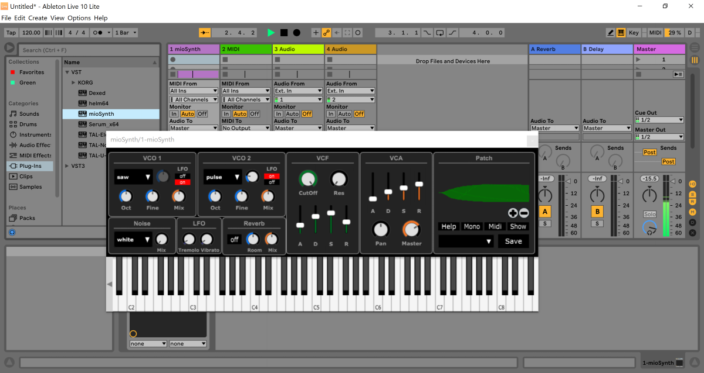
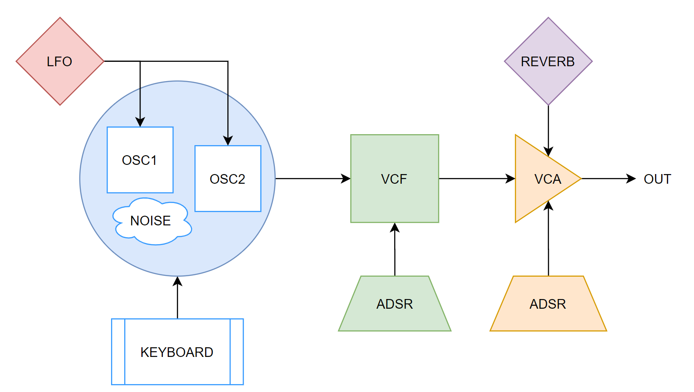
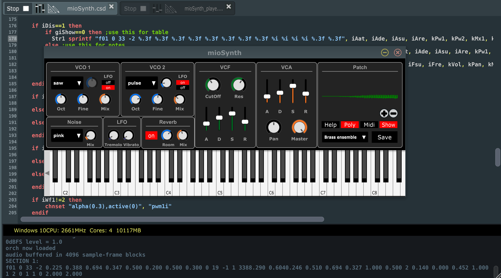

<h3>mioSynth</h3>

Welcome to <strong>mioSynth</strong> a simple way to build an orchestra for <a href="https://csound.com/">cSound</a> and play your favorite melody. Run it in <a href="https://cabbageaudio.com/">Cabbage</a>, standalone or VST within your own DAW.

<h2>Front panel</h2>

At a first glance you see immediately the classic analog setting, check the schema for more details.

<h3>Run in your DAW</h3>

Say you like Ableton Live, here a screenshot with mioSynth playing out of the box. You can export it as VST instrument or as standalone application.

<h2>Logic schema</h2>

Here every sub-panel is connected according to this diagram.

&nbsp;

<h3>Midi</h3>

Connect your midi keyboard and control in realtime <strong>mioSynth</strong>, to customize check in the source code.

&nbsp;

<h3>Mono</h3>

Selecting the <strong>mode</strong> you choose between monophonic or polyphonic. If you playback with <strong>mioSynth_player</strong>, it will run always polyphonic.

&nbsp;

<h3>Show</h3>

Let you copy the string to add in your score and play the selected patch, check the console log for a line starting with <strong>f1 0 33 -2</strong> or <strong>i1 0 1</strong>. Open <strong>mioSynth_player</strong> and paste the code in the score section, add notes as usual. Remember to use <strong>p6</strong> to specify the ftable (actually it's your patch) you just added.

You may have as many patch as you like, just give the proper ftable number. That would be:

<blockquote>
  
<code>&lt;CsScore&gt;</code> 
  <code>;brass ensamble</code> 
  <code>f01 0 33 -2 0.225 0.388 0.694 0.347 0.500 0.200 0.500 0.300 0 19 -1 1 3388.290 0.6040.246 0.510 0.694 0.327 1.000 0.500 2 0.140 0.000 0.452 1.000 1 2 0 1 1 0 2.000 2.000</code>

  <code>;p1 p2 &nbsp;p3 p4 &nbsp;&nbsp;&nbsp;p5 p6</code> 
  <code>i1 &nbsp;0 &nbsp;&nbsp;1 &nbsp;8.00 &nbsp;.9 1</code> 
  <code>i1 &nbsp;+ &nbsp;&nbsp;. &nbsp;8.08 &nbsp;.9 1</code> 
  <code>e</code> 
  <code>&lt;/CsScore&gt;</code>

</blockquote>
<h3>Patches</h3>

To manage your patches edit the file <strong>mioSynth.snaps</strong>, you can rename or delete patches easily.&nbsp;

&nbsp;

